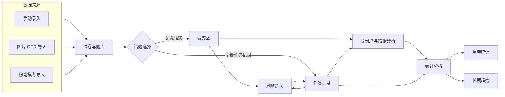
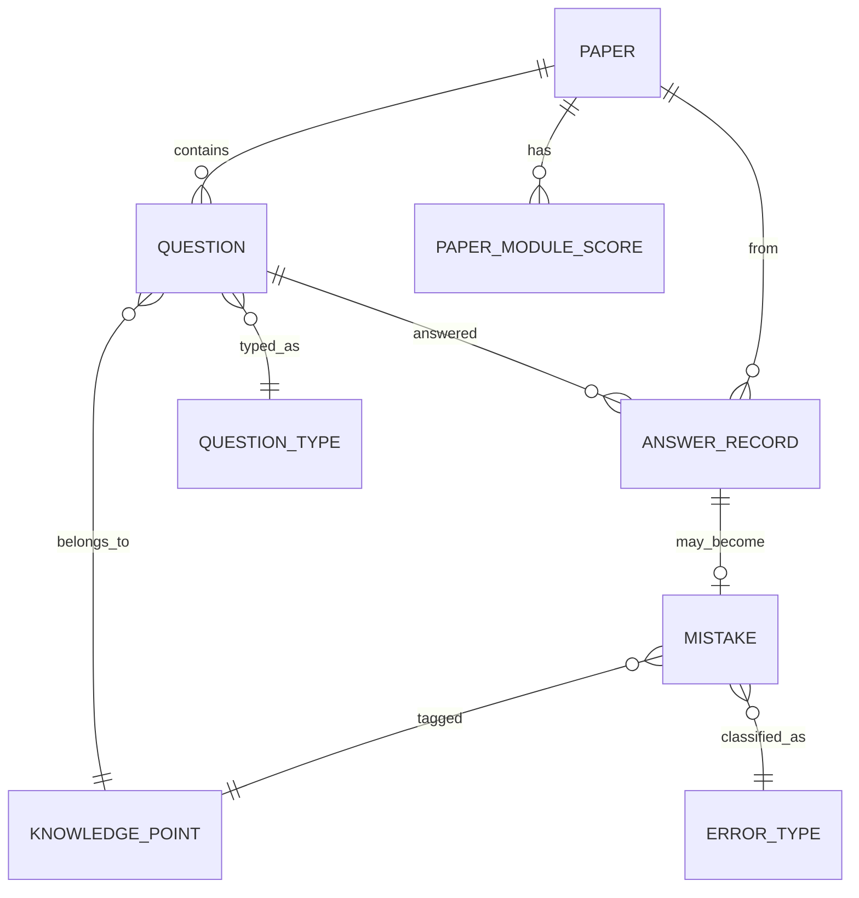

# 行测刷题与错题分析平台 · 详细设计方案

> 面向国考备考的个人刷题工具：把试卷、错题、粉笔模考数据统一录入，自动定位薄弱知识点，用折线、扇形、柱状图追踪单卷与长期进步。离线优先、单机可用。

## 一、项目背景与目标

### 1.1 背景

国考行测题量大、时间紧，提分主要靠高频刷题加错题复盘。但备考中的错题散落在三个地方：纸质试卷（只在卷面上勾画）、粉笔 App 的模考截图（存在相册里难以回看）、手抄错题本（整理耗时且无法统计）。结果就是刷过的题很难变成可分析的数据，不知道哪个知识点反复出错，也看不出长期是否在进步。本工具要解决的，就是让"刷过的题"沉淀成结构化数据，并给出可指导复习的分析结论。

### 1.2 设计目标

| 目标 | 量化标准 |
| --- | --- |
| 录入效率 | 一张 130 题的试卷，手动录入 ≤ 25 分钟；含图片 OCR 或粉笔解析时 ≤ 10 分钟 |
| 薄弱定位 | 每周自动产出薄弱知识点 Top 5，并标注最近 3 次的趋势方向 |
| 统计覆盖 | 至少 3 类视图：单卷错题分布、长期正确率趋势、错题知识点占比 |
| 趋势触发 | 累计录入 ≥ 3 套试卷后即可生成正确率折线 |
| 离线可用 | 全部核心功能在无网络下可用，数据本地存储 |

## 二、系统总体架构



系统由一条数据主线贯穿：三种导入方式写入"试卷与题库"，作答记录与勾选的错题分别沉淀到"作答记录表"和"错题本"，再分别供练习、分析、统计三个消费端使用。错题本是手动勾选的结果，作答记录是每次作答的完整流水，两者共同支撑分析——错题本决定"重点复习哪些"，作答记录决定"正确率和趋势怎么算"。

## 三、功能模块详细设计

### 3.1 模块一：试卷与题目导入

支持三种导入方式，统一写入同一张试卷结构。三种方式的分工：

| 方式 | 适用场景 | 题目数据来源 | 对错数据来源 |
| --- | --- | --- | --- |
| 手动录入 | 纸质试卷、教辅书 | 逐题填写 | 填写自己的作答 |
| 图片 OCR 导入 | 试卷/错题截图 | OCR 识别题干与选项 | 识别后手动修正 |
| 粉笔模考导入 | 粉笔 App 模考成绩 | 解析成绩页文本或截图 | 直接得到每题对错 |

#### 3.1.1 手动录入

页面布局：

```
┌─────────────────────────────────────────────┐
│ 试卷信息：名称[________] 来源[____] 日期[__]  │
│ 题型选择：☑言语 ☐数量 ☐判断 ☐资料 ☐常识      │
├─────────────────────────────────────────────┤
│ 题号  题型   题干         选项A B C D  答案 你的作答 知识点│
│  1   言语   [输入框    ]  [..][..]  B    C    成语辨析│
│  2   数量   [输入框    ]  [..][..]  A    A    行程问题│
│                 [ + 添加题目 ]  [ 保存试卷 ]          │
└─────────────────────────────────────────────┘
```

业务逻辑：用户填写试卷基本信息后逐题录入，每题必填题干、题型、正确答案、自己的作答、所属知识点；保存时系统比对"正确答案"与"你的作答"自动判对错，对错结果写入作答记录表。题型决定后续统计的分组维度，知识点决定薄弱点分析，二者为必填。

字段规则：

| 字段 | 类型 | 必填 | 说明 |
| --- | --- | --- | --- |
| 试卷名称 | 文本 | 是 | 2-40 字 |
| 来源 | 文本 | 否 | 如"粉笔2025模考第3季""中公真题卷" |
| 考试日期 | 日期 | 是 | 用于长期趋势的时间轴 |
| 题号 | 整数 | 是 | 试卷内唯一 |
| 题型 | 枚举 | 是 | 言语/数量/判断/资料/常识 |
| 题干 | 长文本 | 是 | 支持多行 |
| 选项 | 文本组 | 视题型 | 选择题必填，可少于4项 |
| 正确答案 | 文本 | 是 | 单选填字母，多选用逗号分隔 |
| 你的作答 | 文本 | 是 | 可填"未作答" |
| 知识点 | 标签 | 是 | 从知识点库选择或新建 |

#### 3.1.2 图片 OCR 导入

交互流程：用户拖拽或选择一张试卷/错题截图 → 进入"OCR 识别中"状态（预计 ≤ 8 秒）→ 右侧展示识别结果（题号、题型、题干、选项）→ 用户逐项修正 → 确认后一键加入试卷。

```
┌──────────────┬──────────────────────────┐
│ 拖拽图片到此  │ 识别结果（可编辑）        │
│  [预览图]    │ 题号1 言语 [题干___]      │
│              │        A[__]B[__]C[__]    │
│              │ 答案[B] 你的作答[ C ]     │
│              │ 知识点[成语辨析▼]         │
│              │ ─────────────────────    │
│              │ 题号2 ...                 │
│  [重新识别]  │ [全部加入试卷]            │
└──────────────┴──────────────────────────┘
```

业务逻辑：OCR 只负责把图片里的题目结构识别成可编辑文本，不负责判对错；对错由用户在识别结果里补填"你的作答"后由系统比对得出。识别置信度低于阈值的字段高亮提示复核。OCR 引擎优先选离线方案（见第六节），保证无网络可用；识别失败的题目保留为空题号，由用户手动补全，不阻断整张试卷导入。

边界情况：图片模糊或手写体导致识别率低时，提供"仅识别题号、其余手动填"的降级模式；单张图含多题时按题号自动切分，切分错误可手动合并/拆分。

#### 3.1.3 粉笔模考导入

粉笔 App 的模考成绩页包含试卷名、总分、各模块得分、每题对错。导入支持两种入口：复制成绩页文本粘贴、或上传成绩页截图走 OCR。

```
┌─────────────────────────────────────────────┐
│ ○ 粘贴文本   ● 上传截图                       │
│ ┌─────────────────────────────────────────┐ │
│ │ 粘贴粉笔成绩页文本（含各题对错）…        │ │
│ │                                          │ │
│ └─────────────────────────────────────────┘ │
│ [解析]                                       │
│ 解析结果：2025粉笔模考第3季 · 总分72/100      │
│ 言语32/40 数量6/15 判断28/35 资料4/15 常识2/5 │
│ 共130题，错题42，未作答3   [确认导入]         │
└─────────────────────────────────────────────┘
```

业务逻辑：解析阶段从文本/截图中提取试卷元信息与逐题对错，题干内容不在粉笔成绩页中，因此题干留空、后续练习前需补录（或在练习时直接展示"粉笔原题编号"回查原卷）。粉笔各模块名映射到本系统的题型枚举：言语理解→言语、数量关系→数量、判断推理→判断、资料分析→资料、常识判断→常识。逐题对错直接写入作答记录，错的题同时入错题本。

> [假设·待确认] 粉笔成绩页可导出的文本/截图格式以 App 实际版本为准，解析规则需按真实样本调优。解析优先用正则提取结构化字段，复杂版面降级为 LLM 提取。

#### 3.1.4 导入后统一处理

无论哪种方式，保存时都做三件事：校验必填字段、比对答案生成对错、按题型与知识点归类入库。导入完成的试卷进入"试卷列表"，可在列表里看到该卷的总题数、错题数、正确率，并支持追加题目或修正。

### 3.2 模块二：错题选择与管理

不是所有做错的题都值得反复看。本模块让用户在试卷作答后勾选要进错题本的题，并给错题打标签，形成可筛选、可复习的错题库。

```
┌─────────────────────────────────────────────┐
│ 试卷：2025粉笔模考第3季   筛选：[全部▼] [言语▼]│
│ ┌──┬──┬────────┬──────┬──────┬──────┬────┐  │
│ │☑│1 │言语    │成语辨析│答案B │你选C │错 │  │
│ │☐│2 │数量    │行程问题│答案A │你选A │对 │  │
│ │☑│3 │判断    │图形推理│答案D │未作答│错 │  │
│ └──┴──┴────────┴──────┴──────┴──────┴────┘  │
│ 已选 2 题加入错题本  [批量打标签▼] [加入错题本]│
└─────────────────────────────────────────────┘
```

业务逻辑：默认对"答错"和"未作答"的题预勾选，用户可手动调整；点"加入错题本"后，选中题进入错题本并带上传入时的题型、知识点、来源试卷、作答时间。"批量打标签"支持同时给多题打"错误类型"标签（粗心/概念不清/方法不熟/超时未答），这个标签是后续错误分析的关键输入。

错题本支持按题型、知识点、来源试卷、错误类型、加入时间五个维度筛选与排序，并提供"已掌握"标记——标记后该题退出默认复习池但仍保留记录，用于正确率统计。

字段规则：

| 字段 | 类型 | 说明 |
| --- | --- | --- |
| 错题状态 | 枚举 | 待复习/已掌握 |
| 错误类型 | 枚举 | 粗心/概念不清/方法不熟/超时未答 |
| 掌握度 | 0-3 | 练习连续答对次数，达3自动建议标记已掌握 |
| 来源试卷 | 关联 | 来自哪张试卷、哪一题 |

### 3.3 模块三：刷题练习

错题只有反复练才会变成不会再错的题。练习模块从错题本或作答记录中按策略出题，作答结果回写，形成新的作答流水。

出题策略：

| 策略 | 取题范围 | 适用场景 |
| --- | --- | --- |
| 仅错题 | 错题本中"待复习"的题 | 日常错题复盘 |
| 薄弱知识点 | 错误率最高的 Top 5 知识点下的题 | 针对性补弱 |
| 随机抽题 | 全题库 | 保持手感、防止只刷熟题 |
| 按试卷重做 | 指定试卷的全部题 | 模考复盘 |

```
┌─────────────────────────────────────────────┐
│ 出题：●仅错题 ○薄弱知识点 ○随机  进度 3/20  │
├─────────────────────────────────────────────┤
│ 第3题  言语·成语辨析  来源：粉笔模考第3季    │
│ ─────────────────────────────────────────── │
│ 下列各组成语中，全都正确的是：                │
│  A. ……     B. ……                            │
│  C. ……     D. ……                            │
│ 你的作答：[A][B][C][D]      [提交] [跳过]   │
│ 上次错误类型：概念不清                        │
└─────────────────────────────────────────────┘
```

业务逻辑：提交后即时判对错并展示正确答案与解析（如有）；答错自动加入或刷新错题本，答对则该错题"掌握度 +1"，达 3 次连续答对提示标记"已掌握"。每次作答无论对错都写一条作答记录，带时间戳，供长期趋势统计。练习中可随时查看本次正确率与已完成题数。

### 3.4 模块四：薄弱点与错误分析

这是工具的核心价值：不只是记错题，而是告诉用户"哪里弱、为什么弱、在变好还是变差"。

#### 3.4.1 薄弱知识点判定

薄弱度按以下公式计算（数值越大越需关注）：

```
薄弱度 = 错误率 × log2(该知识点累计题量 + 2) × 趋势权重
```

- 错误率 = 该知识点错题数 / 该知识点累计作答题数
- 题量对数项：避免只做了 1 题错 1 题（错误率 100%）就被判为最薄弱，给题量大的知识点更高权重
- 趋势权重：最近 3 次作答错误率上升则权重 >1，下降则 <1，反映"是否在恶化"

系统按薄弱度排序输出 Top 5 知识点，每条展示错误率、累计题量、最近 3 次趋势箭头（↑恶化 / →持平 / ↓改善）。

```
┌─────────────────────────────────────────────┐
│ 薄弱知识点 Top 5           [本周▼]           │
│ 1 成语辨析    错误率 68%  题22  最近3次 ↑↑→  │
│   └ 点击展开：该知识点下的 15 道错题          │
│ 2 资料分析-增长率 52%  题18  ↑→→             │
│ 3 图形推理-立体 47%  题12  →→↓               │
│ 4 逻辑填空 41%  题15  ↑↑↑                   │
│ 5 数量-行程问题 38%  题10  →→→               │
└─────────────────────────────────────────────┘
```

#### 3.4.2 错误类型分析

按"错误类型"标签统计占比，回答"为什么错"。若用户未逐题标注错误类型，系统用规则推断：未作答→超时未答；同一知识点连续错且选项接近→概念不清；曾答对后答错→粗心（不稳）。推断结果标注为"系统推断"以区别于手动标注。

错误类型分布用扇形图展示，让用户一眼看出是"方法不熟"居多还是"粗心"居多，从而决定是补知识还是练熟练度。

#### 3.4.3 模块正确率

按五大题型统计正确率，用柱状图横向对比，定位是"言语拖后腿"还是"数量太弱"。

业务逻辑：分析数据源为全部作答记录（含试卷作答与练习作答），可切换时间范围（本周/本月/全部）。点击任一薄弱知识点或题型，下钻到对应的错题列表，直接进入练习。

### 3.5 模块五：统计分析

统计分两个维度：单张试卷的错题数据统计，以及按时间和试卷的长期统计。两类视图共用同一份作答记录数据，差别在聚合粒度。

#### 3.5.1 单卷统计（针对一张试卷）

| 图表 | 类型 | 展示内容 | 数据口径 |
| --- | --- | --- | --- |
| 各题型错题数 | 柱状图 | 言语/数量/判断/资料/常识各错几题 | 该卷各题型 错题数 |
| 对错占比 | 扇形图 | 答对、答错、未作答三块占比 | 该卷 总题数拆分 |
| 各模块正确率 | 柱状图 | 五大题型各自的正确率 | 该卷各题型 正确数/该题型题数 |

单卷统计回答"这张卷子错在哪、哪个模块拉胯"，是考后复盘的第一屏。

```
单卷统计 · 2025粉笔模考第3季（共130题，错42）
┌─────────────────┬──────────────────┐
│ 各题型错题数(柱) │ 对错占比(扇形)    │
│ 言语 ████████ 18│   ●答对 68%       │
│ 数量 █████ 8    │   ●答错 32%       │
│ 判断 ██████ 10  │   ●未答 2%        │
│ 资料 ███ 4      │                   │
│ 常识 ██ 2       │                   │
└─────────────────┴──────────────────┘
```

#### 3.5.2 长期统计（按时间与试卷）

| 图表 | 类型 | 展示内容 | 数据口径 |
| --- | --- | --- | --- |
| 正确率趋势 | 折线图 | 每张试卷的整体正确率随时间变化 | 按考试日期排序，X轴=日期/试卷，Y轴=正确率 |
| 各模块正确率趋势 | 多折线图 | 五大题型正确率分别随时间变化 | 同上，5条线 |
| 累计错题数 | 折线/柱状 | 错题本总量的增长曲线 | 按周累加，Y轴=累计错题数 |
| 试卷间错题数对比 | 柱状图 | 每张试卷的错题数对比 | 每卷一根柱，标注正确率 |

长期统计回答"我在不在进步、哪个模块在变好"。折线是核心：正确率折线向上、累计错题增速放缓，就是有效备考的信号。

```
长期趋势 · 正确率随试卷变化
 100%│                ●
  80%│      ●    ●----●
  60%│ ●----●
  40%│
     └──────────────────────────
       卷1 卷2 卷3 卷4 卷5  (按日期)
```

业务逻辑：时间维度默认按"考试日期"排试卷作答；练习作答不计入试卷折线，但计入"累计错题数"和"各模块正确率趋势"（练习也是进步的一部分）。时间范围可选近 30 天/近 90 天/全部。空数据点（某时间段无作答）在折线上断开，不做插值，避免虚假趋势。

#### 3.5.3 统计交互

顶部切换"单卷 / 长期"两个标签页。单卷页有试卷下拉选择；长期页有时间范围与模块筛选。所有图表支持点击下钻——点柱子/扇区/折线点跳到对应的错题列表，形成"看图→定位→复习"的闭环。

## 四、数据模型设计



主要表结构：

| 表 | 关键字段 | 说明 |
| --- | --- | --- |
| paper | id, name, source, exam_date, total, correct, wrong, unanswered | 一张试卷的汇总 |
| paper_module_score | paper_id, module, score, total | 粉笔导入的各模块得分 |
| question | id, paper_id, qno, type_id, stem, options, answer, kp_id | 一道题 |
| knowledge_point | id, name, module | 知识点，附所属模块 |
| question_type | id, name | 言语/数量/判断/资料/常识 |
| answer_record | id, question_id, paper_id, user_answer, is_correct, answered_at | 每次作答流水 |
| mistake | id, question_id, kp_id, error_type_id, status, mastery, added_at | 错题本条目 |
| error_type | id, name | 粗心/概念不清/方法不熟/超时未答 |

设计要点：作答记录（answer_record）与错题（mistake）分离——作答记录是只增不改的事实流水，支撑所有正确率与趋势计算；错题本是带状态（待复习/已掌握）的工作清单，支撑练习出题。一张试卷的一道题只有一条 paper 里的作答记录，但练习时会产生新的 answer_record（paper_id 留空、标注 practice），两类记录都进趋势统计。

## 五、技术选型

| 层 | 选型 | 理由 |
| --- | --- | --- |
| 前端 | Vue 3 + Vite | 组件化适合多模块，生态成熟，契合软件工程训练 |
| 图表 | ECharts | 折线/扇形/柱状原生支持，交互下钻方便 |
| 存储 | IndexedDB（离线优先）/ SQLite（若上后端） | 单机优先用浏览器本地库，数据量上千题也够 |
| OCR | Tesseract.js（离线）为主，云 OCR 为增强 | 离线可用是硬目标，云 OCR 仅在联网时提升识别率 |
| 粉笔解析 | 正则 + LLM 兜底 | 结构化字段用正则，复杂版面用大模型提取 |
| 部署 | 纯前端静态包，可本地或 GitHub Pages 托管 | 个人项目无需后端运维 |

## 六、实施阶段规划

- **P0 最小可用**：手动录入 + 错题选择 + 单卷三类统计（柱状/扇形/柱状）。跑通"录入→错题→看图"主线，验证数据结构。
- **P1 分析与趋势**：薄弱点判定算法 + 错误类型分析 + 长期折线/多折线趋势。让工具从"记数据"升级到"出结论"。
- **P2 多源导入增强**：图片 OCR 导入 + 粉笔模考导入 + 错误类型 AI 辅助标注 + 点击下钻闭环。补齐效率与智能化。

每个阶段都是一个可独立使用、可独立验证的版本，避免一次性堆功能导致难以推进。
